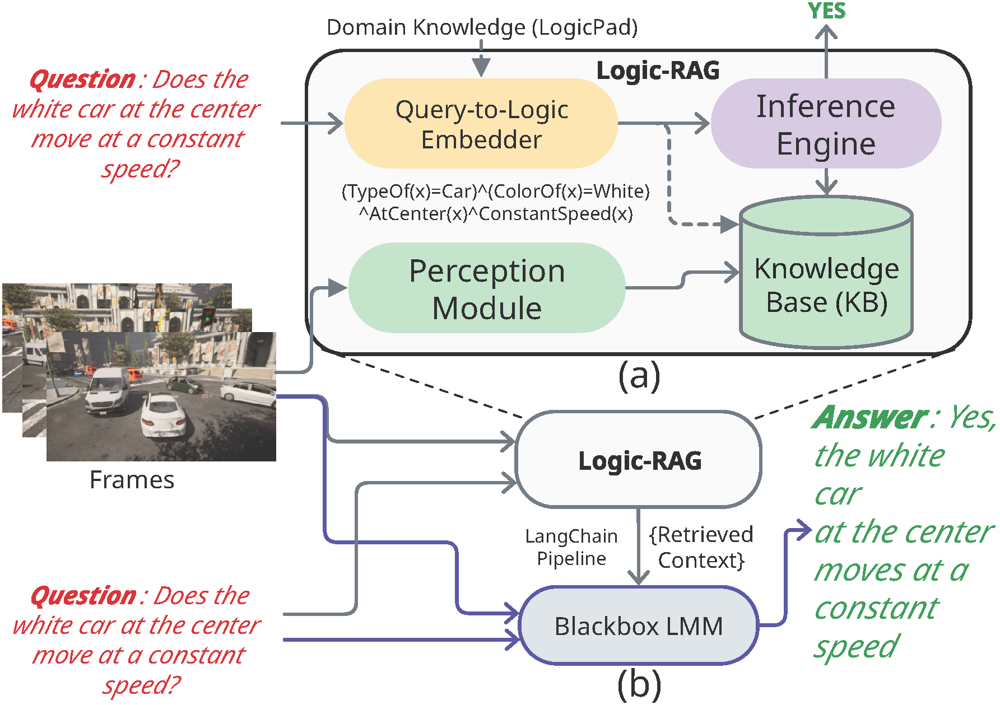

# Logic-RAG

This is the implementation of paper: _"Logic-RAG: Augmenting Large Multimodal Models with Visual-Spatial 
Knowledge for Road Scene Understanding"_
(accepted to ICRA2025) [[Link](https://github.com/Imran2205/LogicRAG)]

Test Logic-RAG on Google Colab: [](https://colab.research.google.com/github/Imran2205/LogicRAG/blob/master/inference/inference.ipynb)

---

## Overview
**Logic-RAG** is a novel Retrieval-Augmented Generation framework that enhances Large 
Multimodal Models' (LMMs) spatial reasoning capabilities in autonomous driving contexts. 
By constructing a dynamic knowledge base of object-object relationships in first-order 
logic (FOL), Logic-RAG significantly improves the accuracy of visual-spatial queries 
in driving scenarios.

This repository contains the complete implementation of the **Logic-RAG** framework, 
including the perception module, query-to-logic embedder, and logical inference engine. 
We provide inference scripts for our proposed framework along with baseline evaluation 
scripts for GPT-4V and Claude 3.5 models to facilitate comparison.

**Logic-RAG framework for visual-spatial reasoning:**


---

## Installation

### Requirements
- Python 3.9
- PyTorch 2.4.1
- CUDA compatible GPU

### Setup Environment
We provide a Conda environment file for easy setup:

```bash
# Clone the repository
git clone https://github.com/Imran2205/LogicRAG.git
cd LogicRAG

# Create and activate conda environment
conda env create -f environment.yaml
conda activate lrag
```

After activating the environment, compile the following script for the Mask2Former model:

```bash
cd perception_module/segmentation/Mask2Former-mod/modeling/pixel_decoder/ops
sh make.sh
```

### Download Pre-trained Models and Precomputed Knowledge Base
Download all the pre-computed knowledge base for KITTI and model weights from the following link:
[Pre-trained Models & KB (Google Drive)](https://drive.google.com/file/d/14vRnzCDD9rw63Os3w-Ii4ZF_352y__km/view?usp=drive_link)

Extract the downloaded file to the root of this repository.

Alternatively, you can download and extract the file using the following commands:
```bash
gdown 14vRnzCDD9rw63Os3w-Ii4ZF_352y__km

unzip LogicRAG_Data.zip
```

### Test Logic-RAG Using Precomputed Data
To run the inference using precomputed knowledge base and tracker trajectories run:

```bash
cd kb_framework/kb_inference

python inference_in_kb.py \
  --csv ../kitti_questions/kitti_que.csv \
  --fol_trans_csv ./translated_queries/question_query_kitti_llama33.csv \
  --kb_dir ../../LogicRAG_Data/precomputed_knowledge_base/kb_out_kitti \
  --tracker_dir ../../LogicRAG_Data/tracker_trajectories/track_out_kitti \
  --output logic_rag_response.csv
```


---

## Usage

The Logic-RAG pipeline consists of several components that need to be run sequentially to generate the knowledge base
and perform inference. Soon, we will share a Google Colab Notebook for running demo. This notebook will combine all the
steps.

### 1. Perception Module

#### 1.1 Segmentation (Mask2Former)
Generate semantic segmentation masks for scene understanding using the following commands:

```bash
cd perception_module/segmentation/Mask2Former-mod

mkdir ../../../track_in_kitti_test/

python demo/demo.py --config-file ./configs/cityscapes/panoptic-segmentation/swin/maskformer2_swin_large_IN21k_384_bs16_90k.yaml \
  --input /path/to/kitti/MOT/testing/image_02/*/*.png \
  --opts MODEL.WEIGHTS ../../../LogicRAG_Data/model_weights/Mask2Former/model_final_064788.pkl \
  --output ../../../track_in_kitti_test/
```

#### 1.2 Depth Estimation (PixelFormer)
To generate depth maps for the scene, run:

```bash
cd perception_module/depth/PixelFormer-mod

python pixelformer/test_lrag.py configs/arguments_test_kitti_depth.txt
```

The configuration file should contain:
```
--model_name pixelformer_kittieigen
--encoder large07
--dataset kitti
--input_height 352
--input_width 1216
--max_depth 80
--do_kb_crop

--data_path /data/datasets/KITTI/MOT/testing
--filenames_file ./data_splits/kitti_lrag_test.txt
--checkpoint_path ../../../LogicRAG_Data/model_weights/PixelFormer/kitti.pth
--output ../../../track_in_kitti_test/
```
Please replace 'data_path' value with the actual path to KITTI MOT test dataset.

Note: You can either use `./data_splits/kitti_lrag_test.txt` as `filenames_file` without modification 
or 
ensure your `filenames_file` contains lines in the format:
```
image_02/0000/000000.png
image_02/0000/000001.png
```
Or,
```
image_02/0000/000000.png image_02/0000/000000.png 1000.0
image_02/0000/000001.png image_02/0000/000001.png 1000.0
```


#### 1.3 Optical Flow Estimation (CoTracker3)
Run the following commands to generate optical flow data:

```bash
cd perception_module/optical_flow/co-tracker

python demo_frame.py \
  --dataset_root /data/datasets/KITTI/MOT/testing/image_02 \
  --output_dir ../../../track_in_kitti_test/ \
  --checkpoint ../../../LogicRAG_Data/model_weights/CoTracker3/scaled_offline.pth \
  --sample_interval 5 \
  --dataset KITTI
```

### 2. Tracking Module

#### 2.1 Key Point Extraction
Extract static key points to serve as anchors for multilateration during tracking:

```bash
cd perception_module/tracking

python key_point_extractor.py \
  --data_dir ../../track_in_kitti_test/ \
  --output_dir ../../track_in_kitti_test/ \
  --distance_threshold 0.8 \
  --sample_interval 20 \
  --max_depth 50 \
  --dataset KITTI
```

#### 2.2 Object Instance Tracking
Track objects across frames and save the trajectories to `../../track_out_kitti_test`:

```bash
cd perception_module/tracking

python new_tracker.py \
  --data_dir ../../track_in_kitti_test/ \
  --output_dir ../../track_out_kitti_test \
  --type_model_path ../../LogicRAG_Data/model_weights/TypeDetector/best_type_model.pth \
  --color_model_path ../../LogicRAG_Data/model_weights/ColorDetector/best_color_model.pth \
  --num_processes 8 \
  --rgb_base_dir /data/datasets/KITTI/MOT/testing/image_02 \
  --dataset KITTI
```

### 3. Knowledge Base Generation

Generate the FOL knowledge base from tracking data and save to `../../kb_out_kitti_test`:

```bash
cd kb_framework/kb_generator

python final_KB_gen.py \
  --tracker_dir ../../track_out_kitti_test \
  --output_dir ../../kb_out_kitti_test \
  --logic_pad ../LogicPad/LogicPad.yaml \
  --window_size 10 \
  --dataset KITTI \
  --num_processes 30
```

### 4. Query-to-Logic Translation

Use the notebook `kb_framework/kb_inference/fol_translate_llama.ipynb` to translate natural language questions 
to first-order logic. The translations will be saved to a CSV file 
(e.g., `./kb_framework/kb_inference/translated_queries/question_query_kitti_llama33.csv`).

### 5. Inference

Run inference using the generated knowledge base:

```bash
cd kb_framework/kb_inference

python inference_in_kb.py \
  --csv ../kitti_questions/kitti_que.csv \
  --fol_trans_csv ./translated_queries/question_query_kitti_llama33.csv \
  --kb_dir ../../kb_out_kitti_test \
  --tracker_dir ../../track_out_kitti_test \
  --output logic_rag_response.csv
```

To run the inference using precomputed knowledge base and tracker trajectories run:

```bash
cd kb_framework/kb_inference

python inference_in_kb.py \
  --csv ../kitti_questions/kitti_que.csv \
  --fol_trans_csv ./translated_queries/question_query_kitti_llama33.csv \
  --kb_dir ../../LogicRAG_Data/precomputed_knowledge_base/kb_out_kitti \
  --tracker_dir ../../LogicRAG_Data/tracker_trajectories/track_out_kitti \
  --output logic_rag_response.csv
```

### 6. Baseline Models (Optional)

#### GPT-4V
Generate responses using GPT-4V for comparison:

```bash
cd baselines

python get_gpt4_response.py \
  --csv /path/to/kitti_questions/kitti_que.csv \
  --frames_dir /path/to/kitti/MOT/testing/image_02 \
  --output gpt4v_response.csv \
  --log_dir ./logs
```

#### Claude 3.5
Generate responses using Claude 3.5 for comparison:

```bash
cd baselines

python get_claude_response.py \
  --csv /path/to/kitti_questions/kitti_que.csv \
  --frames_dir /path/to/kitti/MOT/testing/image_02 \
  --output claude_response.csv \
  --log_dir ./logs
```

## Dataset

We evaluate Logic-RAG on both synthetic and real-world driving scenes:

1. **Synthetic Driving Scenes**: Generated using a controlled environment to test specific spatial reasoning capabilities.
2. **Real-World Driving Scenes**: Derived from the KITTI Multi-Object Tracking dataset. It provides challenging real-world scenarios.

## Results

Logic-RAG significantly improves spatial reasoning accuracy:

- **Baseline LMMs**: GPT-4V and Claude 3.5 achieved only 55% accuracy on synthetic scenes and <75% on real-world scenes.
- **Logic-RAG augmented**: Increased accuracies to >80% on synthetic and >90% on real-world scenes.
- **Ablation study**: Even without logical inference, fact-based context from Logic-RAG improved accuracy by 15%.

## Citation

If you find our work useful in your research, please consider citing:

```bibtex
```

## License


## Acknowledgements

We thank the authors of the following projects whose code we have adapted or used:
- [Mask2Former](https://github.com/facebookresearch/Mask2Former)
- [PixelFormer](https://github.com/ashutosh1807/PixelFormer)
- [CoTracker3](https://github.com/facebookresearch/co-tracker)
